# TP1

1. Database
2. Backend API
3. HTTP server

## 1. Database

**Dockerfile :**

```dockerfile
FROM postgres:17.2-alpine

ENV POSTGRES_DB=db \
    POSTGRES_USER=usr \
    POSTGRES_PASSWORD=pwd
```

On utilise l’image de base PostgreSQL, puis on définit le nom de la base de données, l’utilisateur et le mot de passe. Le mot de passe est défini avec la valeur `pwd`.
On construit ensuite l’image `my-postgres-db` avec la commande `docker build -t my-postgres-db .` depuis le dossier `database`.

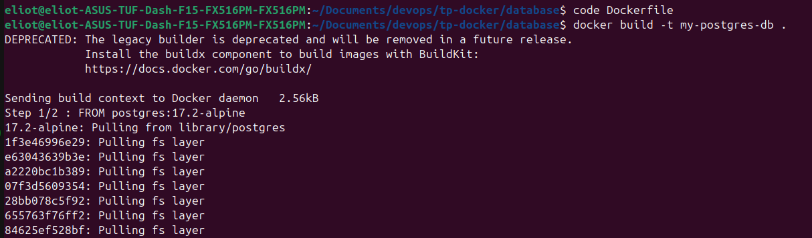

**Lancer le conteneur PostgreSQL :**

```bash
docker run --name database --network app-network -d my-postgres-db
```
Cette commande crée le conteneur, le connecte au réseau `app-network`, puis le lance en arrière-plan. 
La commande `docker ps` permet de vérifier que le conteneur est bien démarré.

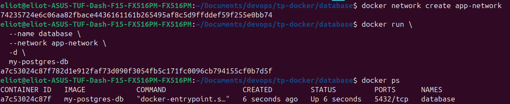

**Lancer Adminer :**

```bash
docker run -p 8090:8080 --network app-network --name adminer -d adminer
```

`-p 8090:8080` : cette option relie le port 8090 de la machine au port 8080 du conteneur Adminer.
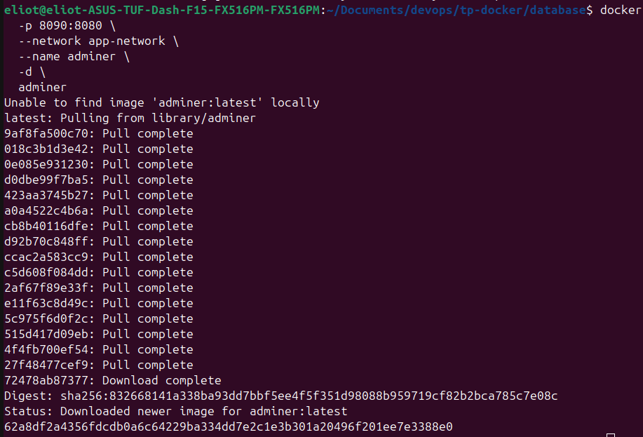

Une fois Adminer lancé, on accède à l’interface sur le port 8090 et on configure la connexion à la base de données. 
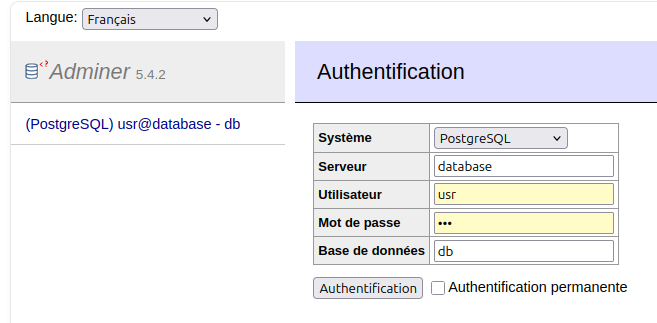
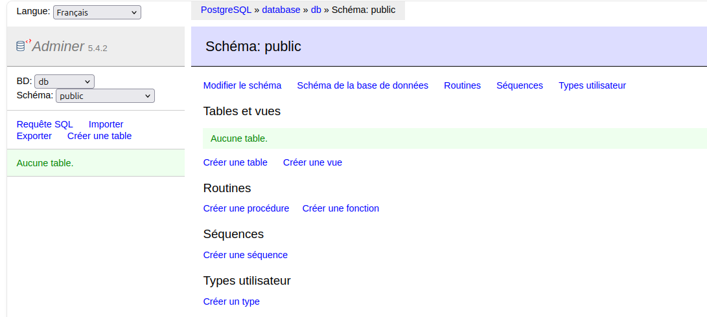

### Question 1-1 :
La configuration actuelle du Dockerfile n’est pas sécurisée :

```dockerfile
ENV POSTGRES_PASSWORD=pwd
```
Le mot de passe est stocké en clair dans l’image. Avec l’option `-e POSTGRES_PASSWORD=pwd`, l’image reste générique et le mot de passe n’est plus écrit directement dans le Dockerfile.

**Pour initialiser la base de données :**

```dockerfile
COPY init-db/ /docker-entrypoint-initdb.d/
```
Cette instruction copie le contenu du dossier local `init-db` vers le dossier d’initialisation de PostgreSQL dans le conteneur.
Au premier démarrage du conteneur, PostgreSQL exécute automatiquement les scripts SQL présents dans ce dossier.
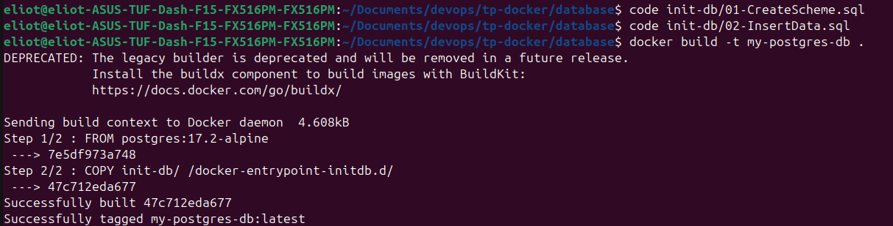

**Relance de PostgreSQL avec les scripts SQL :**
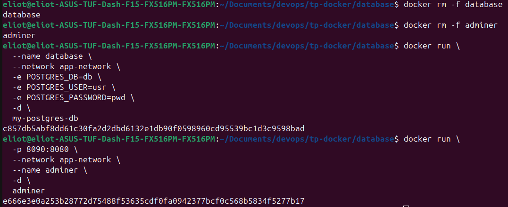
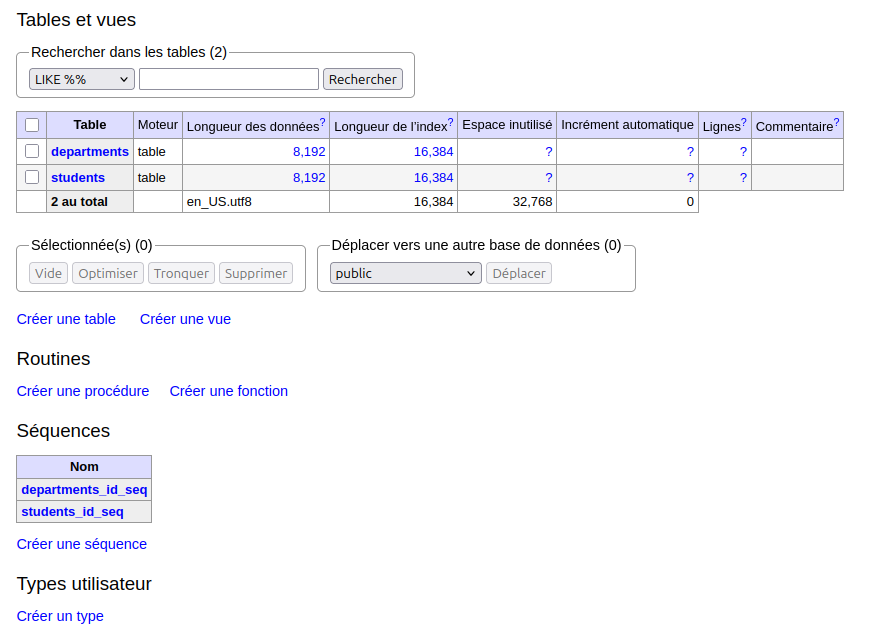

Pour le moment, si le conteneur est supprimé, les données le sont également. Pour éviter cela, on utilise un volume avec l’option suivante :

```bash
-v "$(pwd)/data:/var/lib/postgresql/data"
```
Grâce à ce volume, les données sont conservées dans le dossier `database/data`.
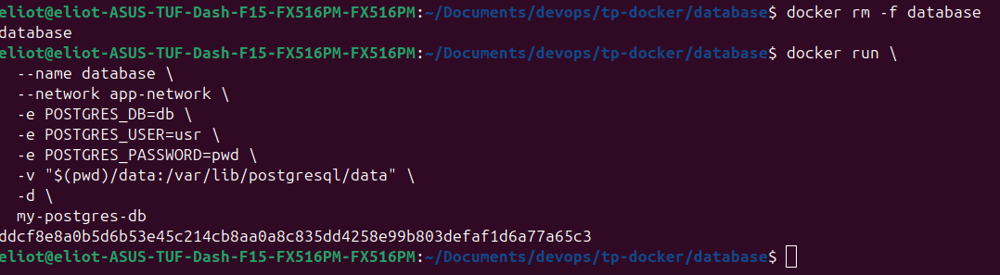

**Test de la persistance :**
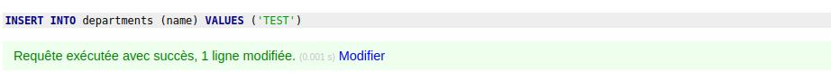
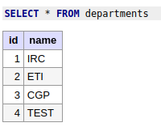
Une fois le conteneur relancé avec l’option `-v`, les données sont toujours présentes. 

### Question 1-2 :
Comme expliqué précédemment, sans volume, les données de la base sont supprimées avec le conteneur. Avec un volume, elles persistent.

### Question 1-3 :

Dockerfile :

```dockerfile
FROM postgres:17.2-alpine

COPY init-db/ /docker-entrypoint-initdb.d/
```

Construction :

```bash
docker build -t my-postgres-db .
```

Réseau :

```bash
docker network create app-network
```

Conteneur PostgreSQL :

```bash
docker run \
  --name database \
  --network app-network \
  -e POSTGRES_DB=db \
  -e POSTGRES_USER=usr \
  -e POSTGRES_PASSWORD=pwd \
  -v "$(pwd)/data:/var/lib/postgresql/data" \
  -d \
  my-postgres-db
```

Adminer :

```bash
docker run \
  --name adminer \
  --network app-network \
  -p 8090:8080 \
  -d \
  adminer
``` 

Commandes utiles :

```bash
docker rm -f
docker ps
```

## 2. Backend API

**Hello-world :**

Configuration du Dockerfile :

```dockerfile
FROM eclipse-temurin:21-jre-alpine

WORKDIR /usr/src/app

COPY Main.class .

CMD ["java", "Main"]
```
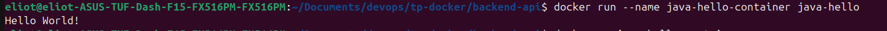

**Version multistage :**
On utilise un build multistage afin que Docker compile lui-même l’application. 
Dockerfile modifié :

```dockerfile
FROM eclipse-temurin:21-jdk-alpine AS build

WORKDIR /usr/src/app

COPY Main.java .

RUN javac Main.java

FROM eclipse-temurin:21-jre-alpine

WORKDIR /usr/src/app

COPY --from=build /usr/src/app/Main.class .

CMD ["java", "Main"]
```

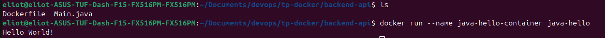

**Simple API :**
On ajoute les configurations nécessaires, puis on construit et on lance l’image.
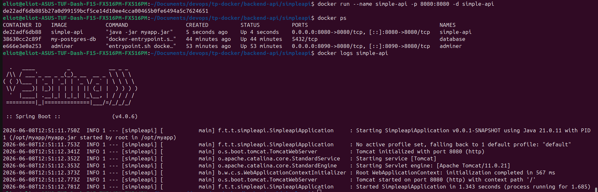
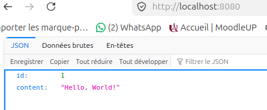

**Question 1-4 :**
Le multistage build permet de séparer les étapes de build afin d’avoir une image finale plus légère, plus propre et plus sécurisée, car elle contient uniquement ce qui est nécessaire pour exécuter l’application. 

**On relie le backend et la base de données :**
Test avec un appel API :

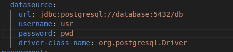
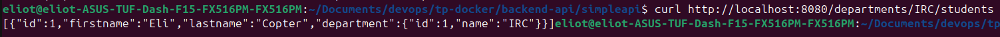

## 3. HTTP Server
 
**Mise en place de la page :**
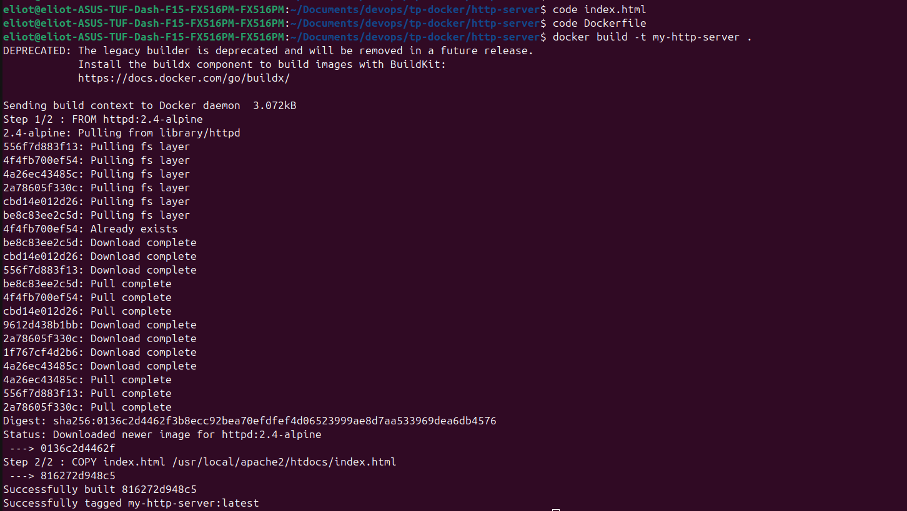
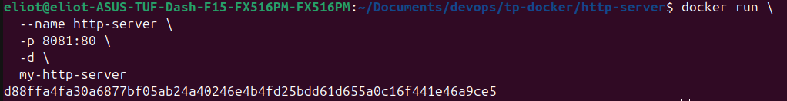

**`docker stats` :**
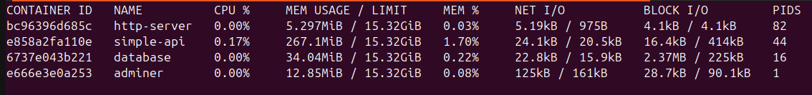

**`docker logs` :**
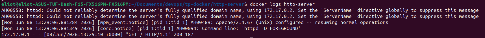

**Récupération de la configuration Apache :**
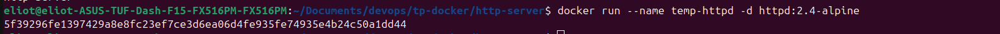

**Copie de la configuration :**
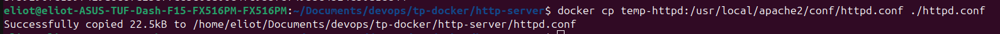

**Question 1-5 :**
Un reverse proxy permet de ne pas exposer directement le backend. Il devient le point d’entrée unique de l’application.

**Configuration Docker Compose :**
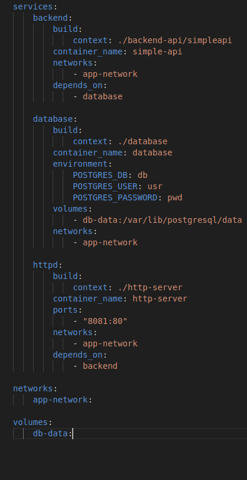

**Lancement de Docker Compose et vérification :**
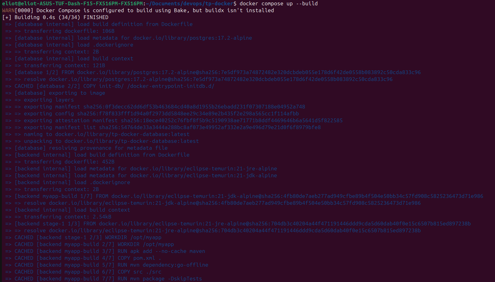
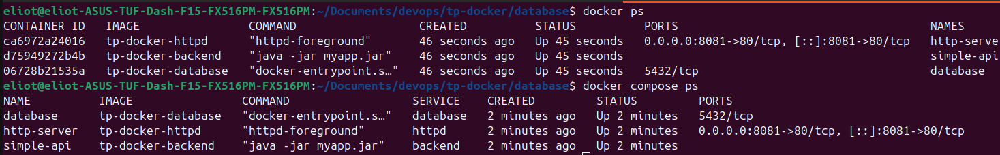
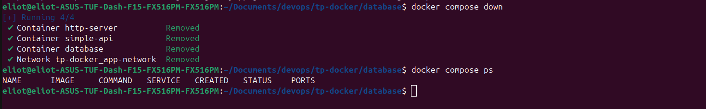

**Question 1-6 :**
Docker Compose est important parce qu’il permet de gérer plusieurs conteneurs en même temps avec un seul fichier de configuration. Cela rend le projet beaucoup plus simple à utiliser.

**Question 1-7 :**
- Voir **Lancement de Docker Compose et vérification**
- `docker compose stop` arrête les conteneurs sans les supprimer.
- `docker compose logs` affiche les journaux complets des services. 

**Question 1-8 :**
Un reverse proxy permet de ne pas exposer directement le backend. Il devient le point d’entrée unique de l’application.

**Question 1-9 :**
La commande `docker login` permet de se connecter. 
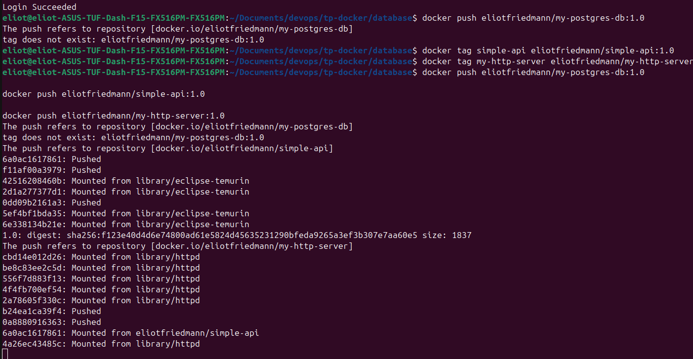

**Question 1-10 :**
Les images sont publiées afin d’être facilement accessibles en ligne. Elles peuvent ensuite être récupérées par d’autres personnes avec la commande `docker pull`.

# TP2

`mvn clean install` :
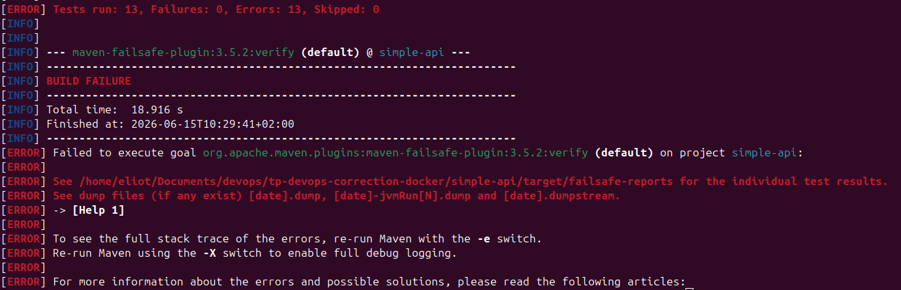

**Question 2-1 :**
Ce sont des bibliothèques Java qui permettent de lancer plusieurs conteneurs pendant les tests.

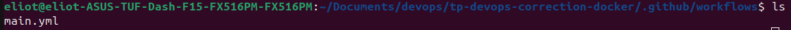

Premier workflow d’intégration continue avec les tests backend :
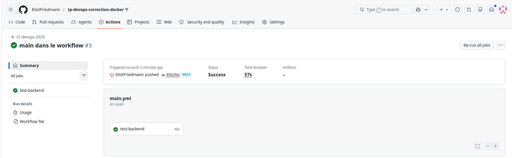

**Question 2-2 :**

On utilise des secrets et des variables sécurisées pour stocker des informations sensibles, comme un identifiant Docker Hub, un mot de passe, un token ou une clé API, sans les écrire directement dans le code source.

Si ces informations étaient écrites dans le fichier `main.yml`, elles seraient visibles dans le dépôt GitHub. Cela pourrait permettre à quelqu’un d’utiliser notre compte Docker Hub à notre place.

**Question 2-3 :**
Cela permet de garantir que le build et la publication des images Docker ne se lancent que si les tests du backend réussissent. Un backend qui ne fonctionne pas ne peut pas être publié.

**Question 2-4 :**
On publie les images Docker sur Docker Hub pour pouvoir les stocker, les partager et les réutiliser sur d’autres machines. 

`main.yml`
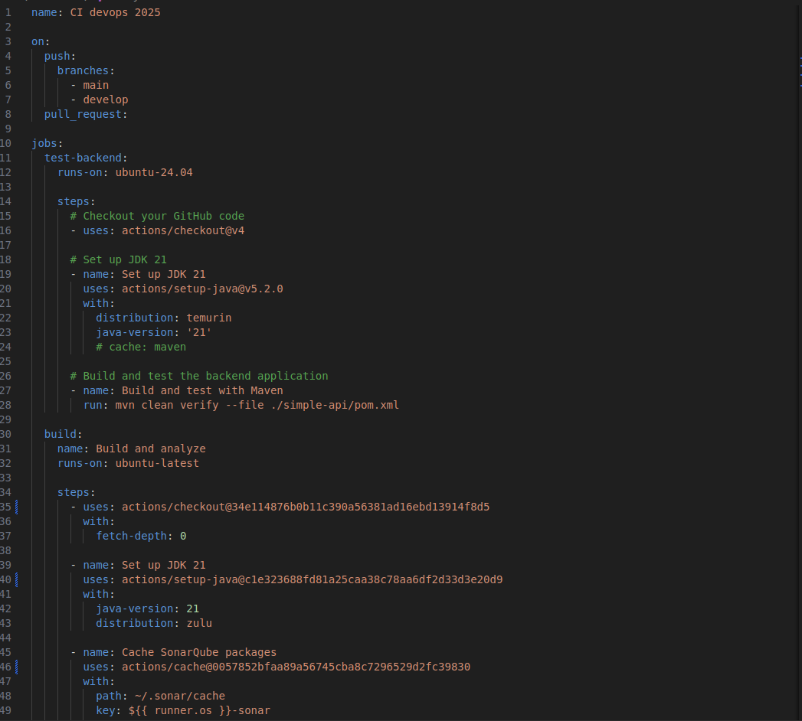
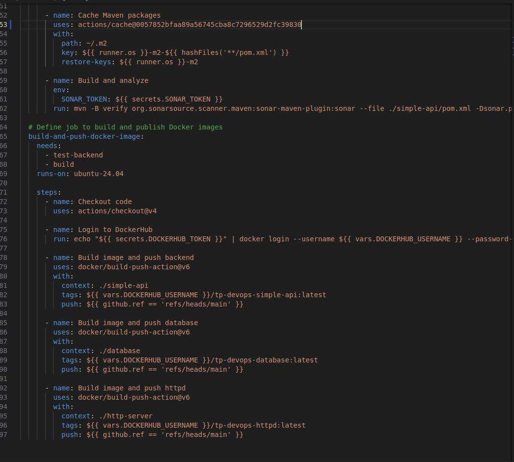

Séparation du pipeline
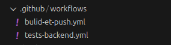
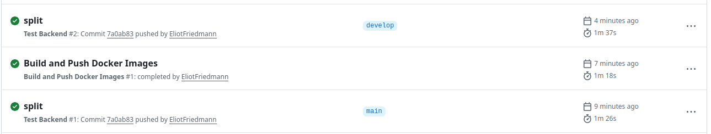

# TP3
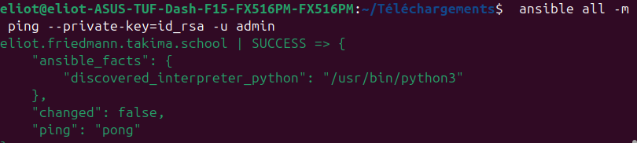

Test de l’inventaire et récupération des faits 
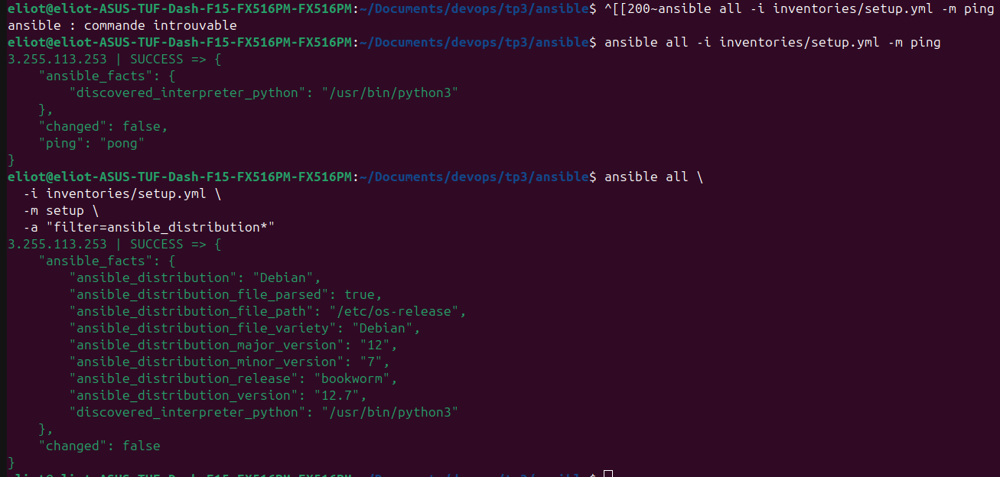

**Question 3-1 :**
### 3-1 Inventaire et commande de base

`ansible/inventories/setup.yml` :

```yaml
all:
  vars:
    ansible_user: admin
    ansible_ssh_private_key_file: /home/eliot/Téléchargements/id_rsa

  children:
    prod:
      hosts:
        3.255.113.253:
```

`all` représente tous les hôtes de l’inventaire.
`ansible_user` définit l’utilisateur utilisé pour la connexion SSH.
`ansible_ssh_private_key_file` définit le chemin vers la clé SSH privée.

La partie `children` contient le groupe `prod`. Ce groupe rassemble les serveurs utilisés pour la production.

**Playbook :**
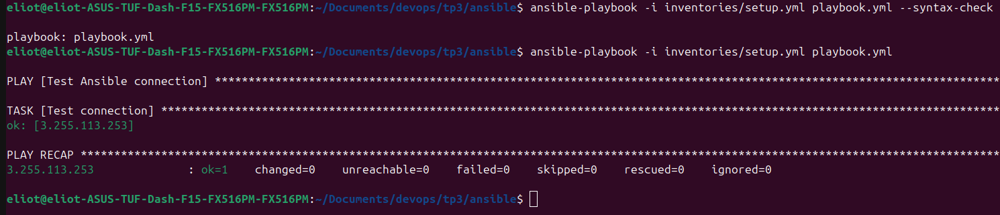

**Arborescence des rôles :**
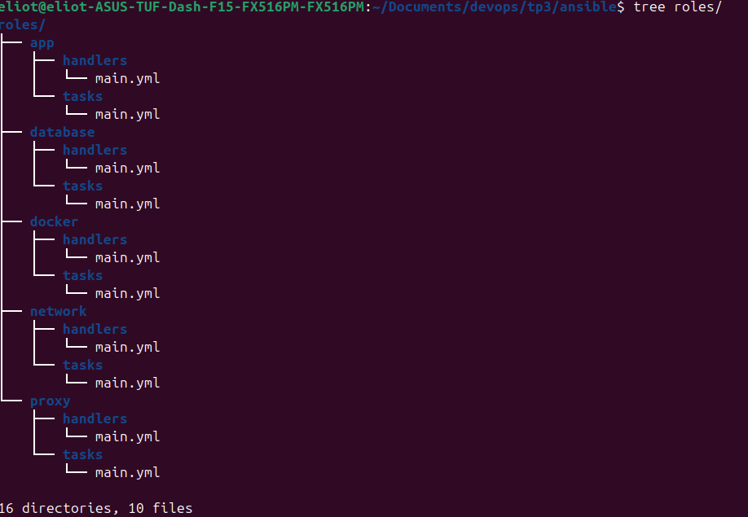

**API fonctionnelle :**
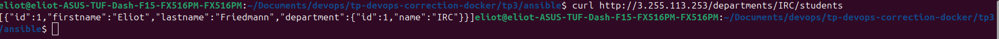

## Question 3-2 : Documenter le playbook

Le playbook principal permet de déployer automatiquement l’ensemble de l’application sur le serveur distant.

```yaml
- hosts: all
  gather_facts: true
  become: true

  roles:
    - docker
    - network
    - database
    - app
    - proxy
```

`hosts: all` indique que le playbook s’exécute sur tous les hôtes de l’inventaire.  
`gather_facts: true` permet à Ansible de récupérer des informations sur le serveur.  
`become: true` permet d’exécuter les tâches avec les droits administrateur.

Les rôles sont exécutés dans l’ordre suivant :

- `docker` installe et démarre Docker ;
- `network` crée le réseau Docker commun ;
- `database` lance PostgreSQL ;
- `app` lance l’API ;
- `proxy` lance le reverse proxy HTTPD.

Le playbook est exécuté avec la commande suivante :

```bash
ansible-playbook -i inventories/setup.yml playbook.yml
```

## Question 3-3 : Configuration des tâches `docker_container`

Le module `community.docker.docker_container` permet de créer et de démarrer les conteneurs Docker depuis Ansible.

Le conteneur `database` utilise PostgreSQL et reçoit ses variables d’environnement pour créer la base, l’utilisateur et le mot de passe. Un volume permet de conserver les données.

Le conteneur `simple-api` utilise l’image du backend publiée sur Docker Hub. Il reçoit les variables nécessaires pour se connecter à PostgreSQL.

Le conteneur `httpd` utilise l’image du reverse proxy et publie le port 80 du serveur.

Les trois conteneurs sont connectés au réseau `app-network`, ce qui leur permet de communiquer avec leurs noms de conteneur.

Les paramètres principaux sont :

```yaml
state: started
restart_policy: always
pull: true
```

- `state: started` garantit que le conteneur est démarré ;
- `restart_policy: always` redémarre automatiquement le conteneur en cas d’arrêt ;
- `pull: true` récupère la dernière version de l’image avant le lancement.

## Déploiement continu

Non, ce n’est pas totalement sûr de déployer automatiquement chaque nouvelle image Docker. Une image peut contenir un bug, une faille ou du code non testé.

Pour sécuriser le déploiement, il faut lancer les tests avant, déployer seulement depuis la branche `main`, utiliser des tags précis au lieu de `latest`, protéger les secrets GitHub et éventuellement ajouter une validation manuelle avant la production.

**Le déploiement fonctionne :**

Le workflow GitHub Actions construit et publie les images Docker, puis lance automatiquement le déploiement avec Ansible sur le serveur distant.

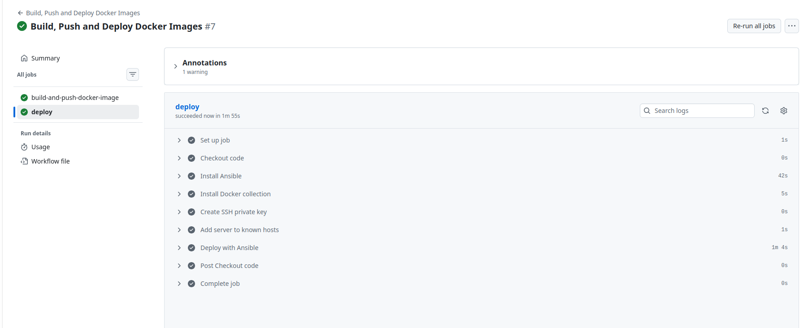

**Frontend fonctionnel :**

Le frontend est accessible depuis le serveur et communique correctement avec l’API à travers le reverse proxy HTTPD.

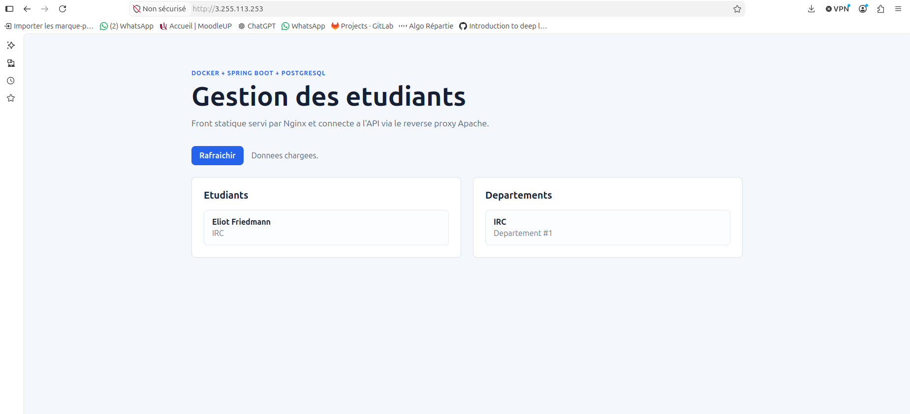
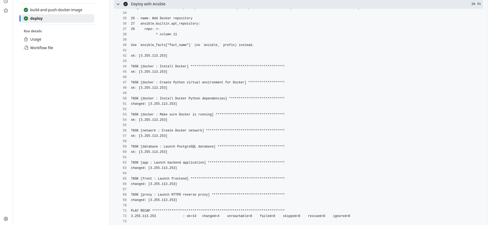
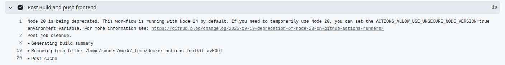

Note : le frontend a été généré avec l’aide d’une intelligence artificielle.
